# Sports Quiz
(Developed by: Marc Hopkins)

[Live webpage](https://marchopkins96.github.io/sports-quiz/)

## Introduction 

Sports Quiz is a multiple choice online quiz testing the sports knowledge of the users who play it. There are three levels to choose from. The user will see how many questions are left as they progress and how many they answer correctly and incorrectly.

## Project Goals

### User Goals
- The site user wants to play an online sports quiz which will test their knowledge about an array of sports.

### Site Developer Goals
- The developer's goal is to provide a fun, engaging and adequately challenging sports quiz for its users.
  
## User Experience 

### Strategy 

#### Target Audience
- Users who have a keen interest in sports.
- Users who are looking to put their sports knowledge to the test.
  
#### User Expectations
- Site easy to navigate around.
- Feedback as a user progresses through the quiz.
- Visually appealing design.

#### User Stories

##### First-Time User 
As a first time user, I want to ...
1. easily navigate through the quiz.
2. get feedback on scores as i progress.
3. easily return to the beginning and play again.
   
##### Returning Users
As a returning user, I want to ...
1. Try different levels.
2. Beat my previous scores.
3. potentially check out the developer who made the quiz.

### Structure & Design 

#### Wireframes

1. **Home Section** displays a short introduction to the quiz and the users are encouraged to click the 'How to Play' button. Further down the page there is an option to enter and submit a username.

2. **How To Play** Once the how to play button has been clicked it will appear as a pop up card on the screen. It will feature all the instructions for the quiz game. Once a user is finished with the page an exit button will take them back to the home page.

3. **Question Level Choice** The user has three sets of multiple choice questions to choose from.

4. **Quiz Question Area** The user has 10 questions to answer once in this part of the site. The scores will be tracked at the bottom of the quiz card.

5. **End of Quiz Section** Displays a users final score at what level they chose to play at. A short message will appear for the user which will differ depending on how they scored. There will also be a play again option.

6. **404 Error Page** A simple 404 page is also included (404.html).

#### Colour Scheme 

The colour scheme is a mix of dull and warm colours. I wanted the background to be in a linear gradient style as i thought this gave the page an eye catching look. All clickabe buttons are coloured in the warm red in keeping with the colour scheme when hovered over. The main area of the Quiz functions will remain in white and the text be black or grey to maintain a good level of contrast and readability.

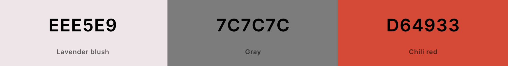

#### Font

Nunito font has been used for all headings in the quiz, all other features of the game have Lato font applied to them.

## Features 

### Home Page Section 

Screenshot of Home Page section

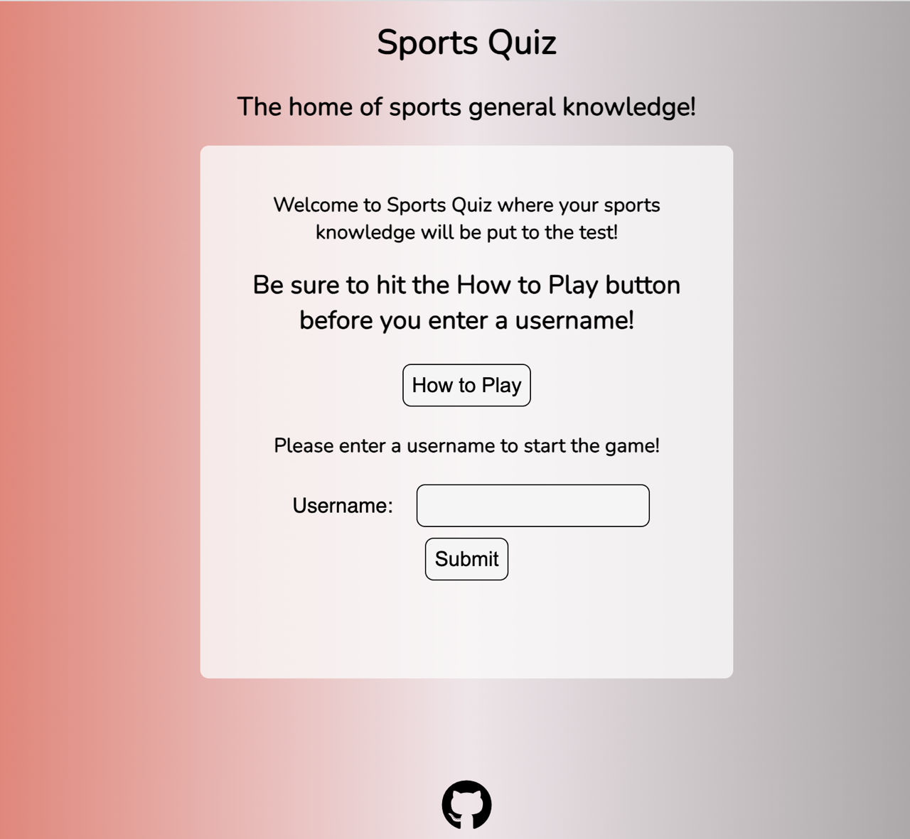

- Features a heading and sub-heading of the quiz. 
- Within the contrasting white quiz card area there is a short introduction to the quiz followed by a message encouraging the user to click the 'How to Play' button before submitting a username.
- Below that users are instructed to enter a username in the box provided and then click the submit button below. 
- A link to the developers GitHub account is also included in the footer.

### Question Level Choice Section 

Screenshot of the Qustion Level Choice Section

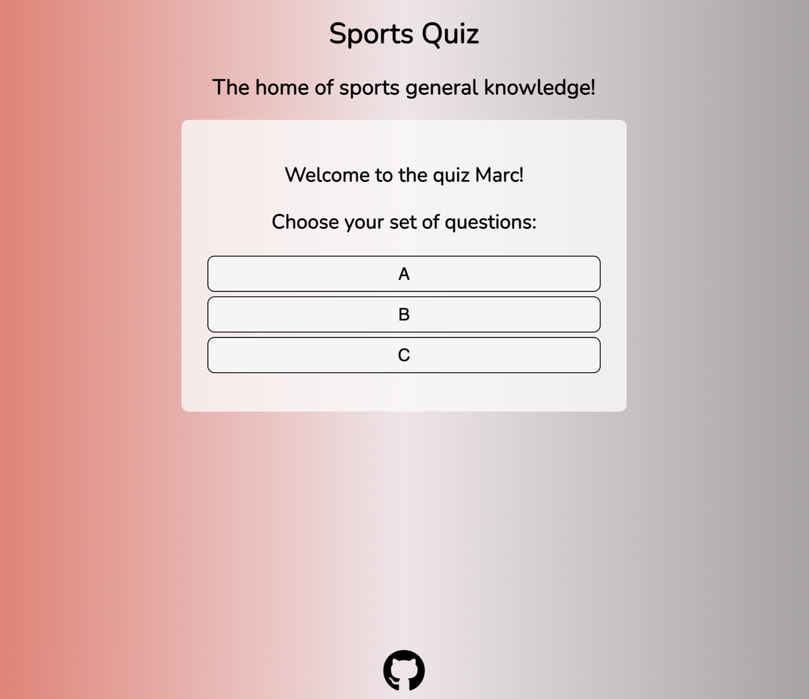

- Features three clickable levels that a user can choose from: 'A', 'B' or 'C'.

### Quiz Questions Section

Screenshot of Quiz Questions Section

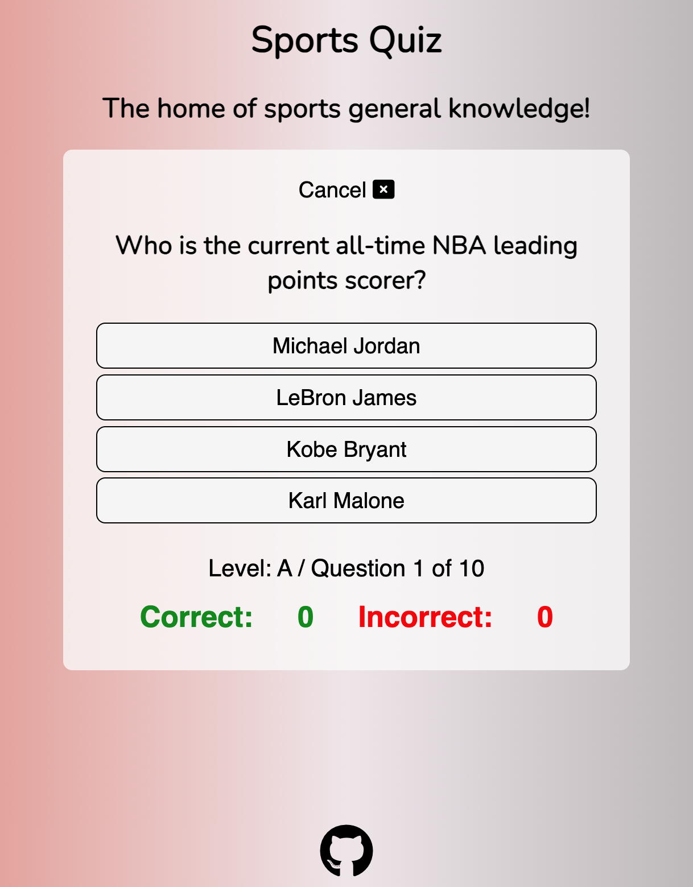

- features the question which is displayed at the top of the quiz card area.
- Four clickable possible answers are listed below the question.
- There is a score area at the bottom of the card that keeps track of a users correct and incorrect answers every time an answer is submitted. It also tracks the amount of questions that are in the users chosen level.
- When users hover over answers the answers the cursor changes to a pointer to indicate which answer they are about to choose.
- A cancel button is featured at the top of the quiz card and if clicked this will end the users game and take them back to the home page.

### End of Quiz Section

Screenshot of End of Game Section

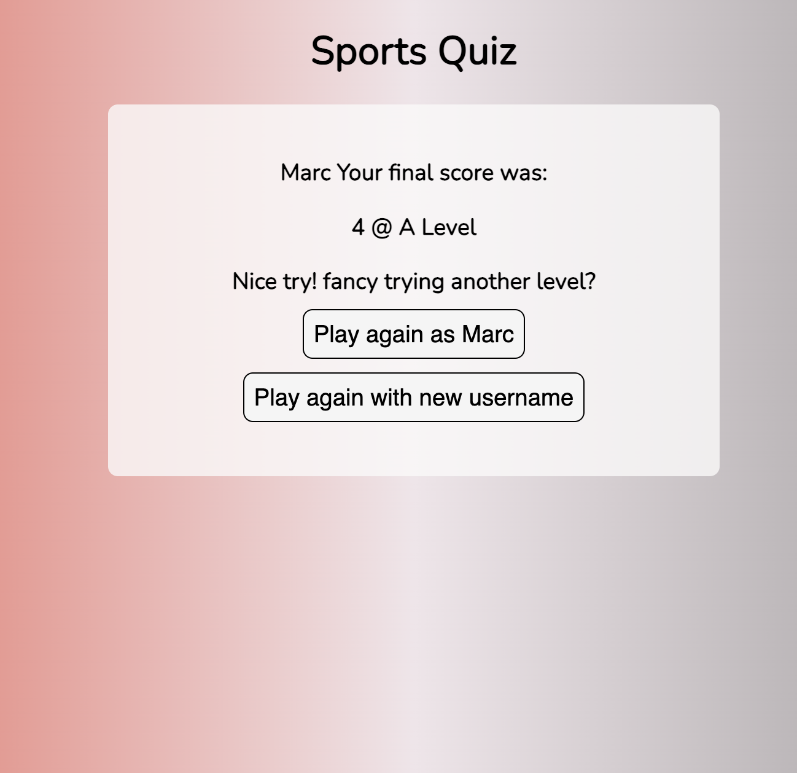

- Features the users final score and at what level was played.
- A personal message is posted to the user which changes depending on the users score.
- At the bottom of the quiz card there are two clickable buttons which allow the user to play again with the same username or with a new one.

### Header

Screenshot of Header

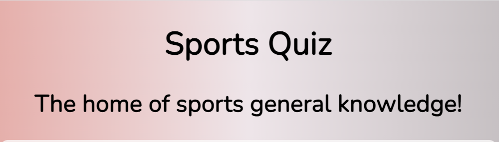

- The header is featured throughout the quiz game.
- The header makes it clear as to what the site is.
  
### Footer 

Screenshot of the Footer

- The footer is featured on all pages apart from the 404 error page.
- The footer is blended with the gradient of the background for a clean look.

### Future Additions 

In the future I would like to implement a leaderboard section so that users can save their highscores and try to beat them.

## Technologies Used

### Languages 
- HTML
- CSS
- JavaScript

### Frameworks & Tools
- Balsamiq
- Coolers
- Font Awesome
- Favicon.ico
- Git
- GitHub
- Google Fonts

### Helpful Websites

- <a href="https://www.w3schools.com/">W3 Schools</a>
- <a href="https://www.freecodecamp.org/">FreeCodeCamp</a>
- <a href="https://www.youtube.com/@JamesQQuick/">James Q Quick Youtube Channel</a>

## Testing & Validation 

### HTML Validation 

The W3C Validation service was used to validate all HTML code in this project. All pages passed without any issues.

Home page and quiz area pages

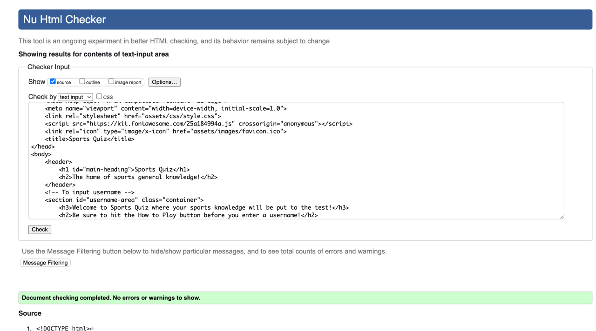

End of Quiz Page

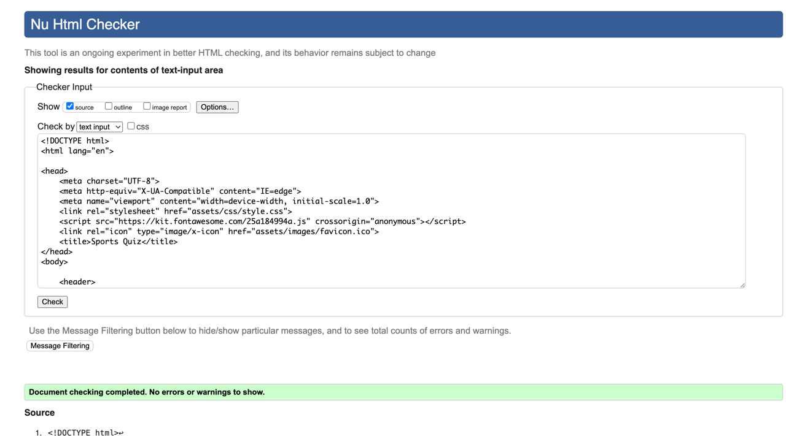

404 Error Page

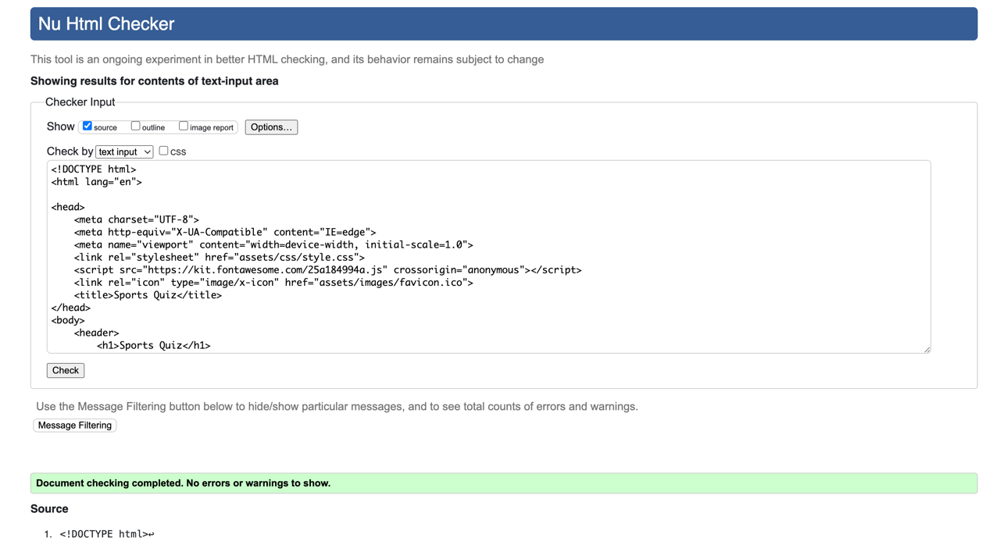

### CSS Validation

The W3C Jigsaw CSS Validation Service was used to validate the CSS code in this project. The code passed with no issues.

CSS Validation

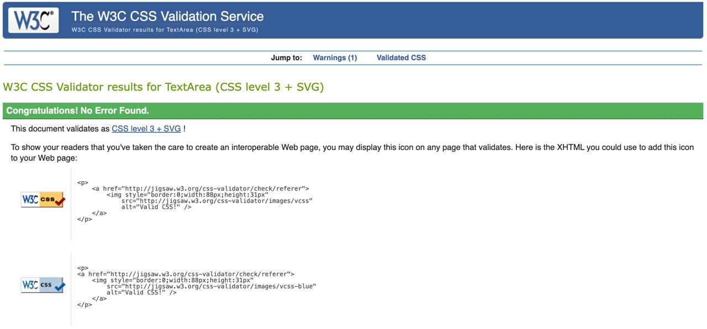

### JavaScript Validation

The linter <a href="https://jshint.com/">JSHint</a> was used to validate all JavaScript code. All passed okay with only minor grammatical errors flagged, which were fixed.

script.js validation part one

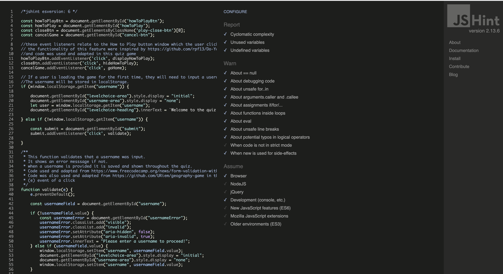

script.js validation part two

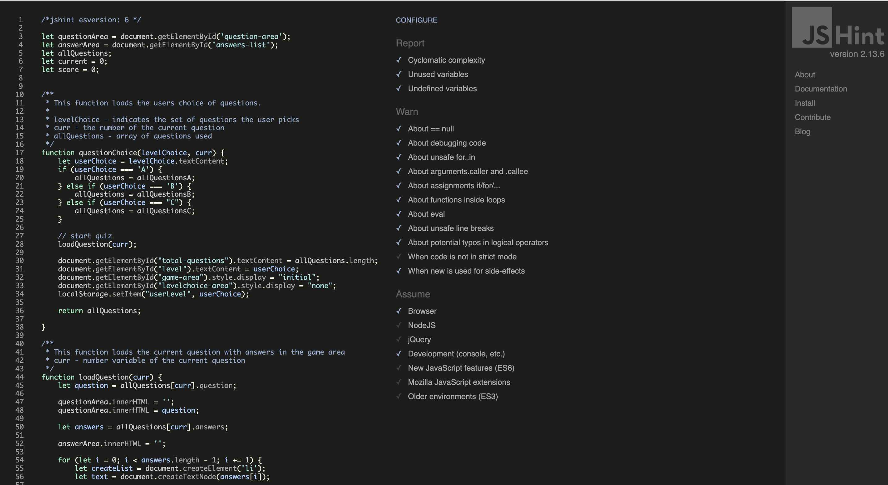

end.js validation

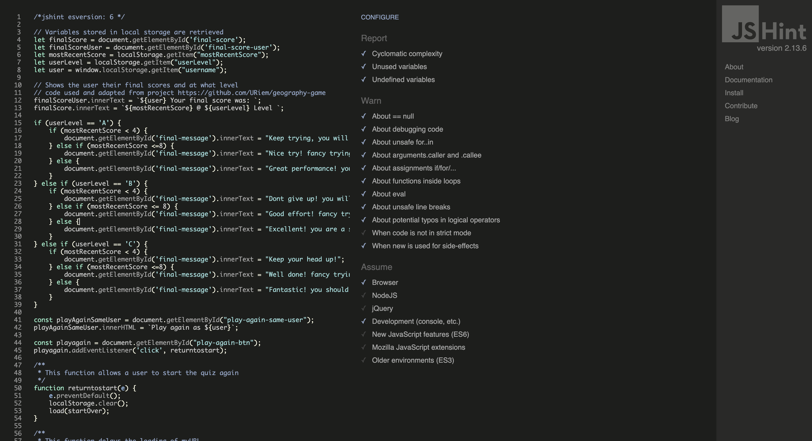

questions.js validation

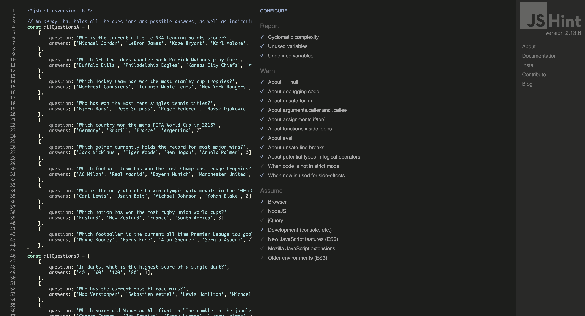

### Accessibility & Performance 

The Lighthouse feature on Google DevTools was used to assess accessibility and performance. The pages in this site scored highly but there is some room for improvement on performance.

Home Page and Quiz Area

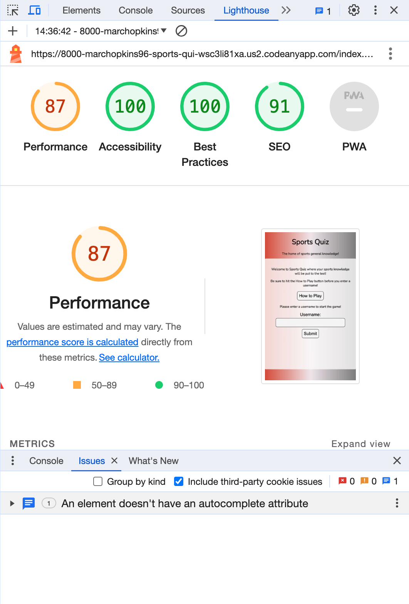

End of Quiz Page

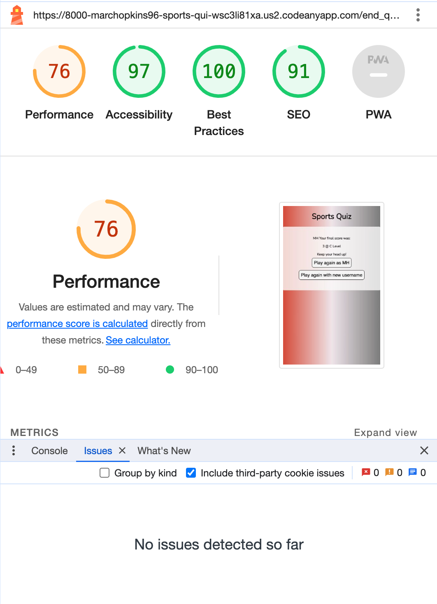

#### Outstanding Issues 

There are no outstanding issues to the developers knowledge at this time.

### Browser Compatability

The website has been tested on the following browsers:

- Google Chrome
- Safari
- Mozilla Firefox
- Microsoft Edge

### Testing and User Stories 

1. As a first time user, i want to easily navigate through the quiz.

| **Feature** | **Action** | **Expected Result** | **Actual Result** |
|-------------|------------|---------------------|-------------------|
| Home Page | Click How to Play Button | The rules of the game display | Works as expected |
| Home Page | Input a username and click submit | The Level Choice page displays | Works as expected |
|Level Choice | Click on chosen level | The  first quiz questions display | Works as expected |
| Quiz Area | Click on chosen answer | New questions display after answering | Works as expected |
| End of Quiz Page | Choose to play again | Home page appears again | Works as expected |

2. As a first time user, i want to be able to track my score throughout the quiz.

| **Feature** | **Action** | **Expected Result** | **Actual Result** |
|-------------|------------|---------------------|-------------------|
| Quiz Area | Click quiz answers of your choice | Your score will tally below the list of answers | Works as expected |

3. As a first time user, i want to easily return to the beginning of the quiz and play again.

| **Feature** | **Action** | **Expected Result** | **Actual Result** |
|-------------|------------|---------------------|-------------------|
| End of Quiz Page | Select to play again | Takes the user back to the start of the quiz | Works as expected |

4. As a returning user, i want to try different levels of questions.

| **Feature** | **Action** | **Expected Result** | **Actual Result** |
|-------------|------------|---------------------|-------------------|
| Level Choice | Choose a level | Play through chosen level | Works as expected |

5. As a returning user, i potentially want find out about the developer who created the quiz.

| **Feature** | **Action** | **Expected Result** | **Actual Result** |
|-------------|------------|---------------------|-------------------|
| Footer social link | Click link in footer | User is taken to GitHub of developer | Works as expected |

## Bugs & Fixes 

| **Bug** | **Fix** |
|---------|---------|
| Cancel Game button didnt return the user to the quiz home page as i had intended it to. It only returned the user as far as the level choice section. | I remembered that this would have been because localStorage was stored and i needed to delete this with the click of the cancel button. I added localStorage.clear() into the function and this fixed the issue.

## Deployment & Development

The website was deployed using GitHub Pages by following these steps:

1. In the GitHub respository navigate to the Settings tab.
2. Select Pages from the menu on the left-hand side of the page.
3. For the source select Branch: 'main' and then select: 'save'.
4. After the webpage refreshes automatically a ribbon at the top will displays the following message: "Your site is live at https://marchopkins96.github.io/sports-quiz/"

The website repository can be forked by the following steps:

1. Go to the GitHub repository.
2. Click on the Fork button in the upper right hand corner.

The repository can be cloned by the following steps:

1. Got to the GitHub repository.
2. Locade the Code button above the list of files and click on it.
3. Select if you prefer to clone using HTTPS, SSH, or Github CLI and click the copy button to copy the URL to your clipboard.
4. Open Git Bash.
5. Change the current working directory to the one where you want the cloned directory.
6. Type git clone and paste the URL from the clipboard ($ git clone <https://github.com/YOUR-USERNAME/YOUR-REPOSITORY>)
7. Press Enter to create your local clone.

## Credits 

### Code 

- Code from Ulrike Riemenschneider's project https://uriem.github.io/geography-game/ was used and adapted in the making of this project. I liked much of the functionality in that project so chose to style mine simililarily. 
- Code from https://rpf13.github.io/Do-You-Know-It/ project gave me inspiration for implementing a 'How to Play' button on the home page. I also took some inspiration from this project to create a linear gradient background.
- The score tracking from the Love Maths project was used and adapted in this project.

### Acknowledgements 

I would like to thank:

- My mentor Mitko Bachvarov for his Feedback, advice and guidance throughout this project.
- Members of the Slack community who answered my questions & queries.
- My partner, Harriet, for her feedback and encouragement throughout.