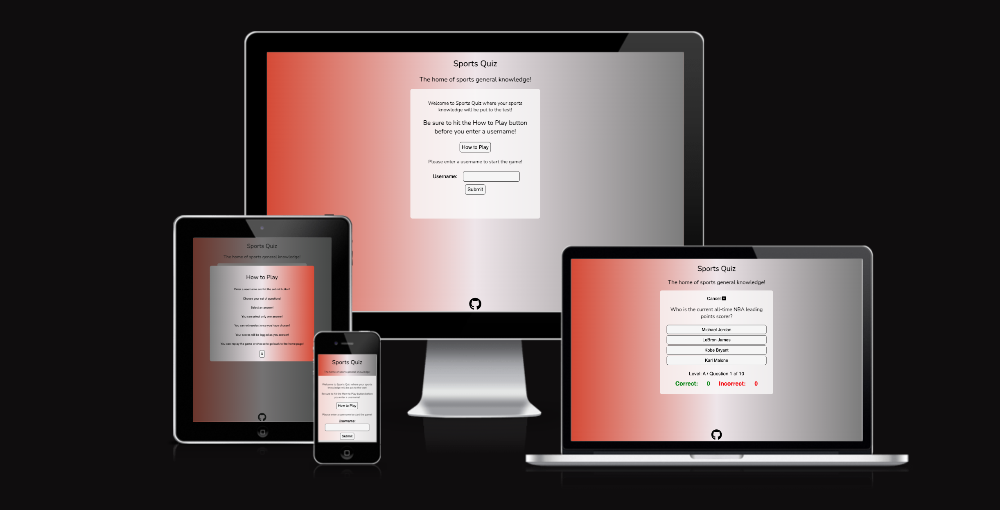
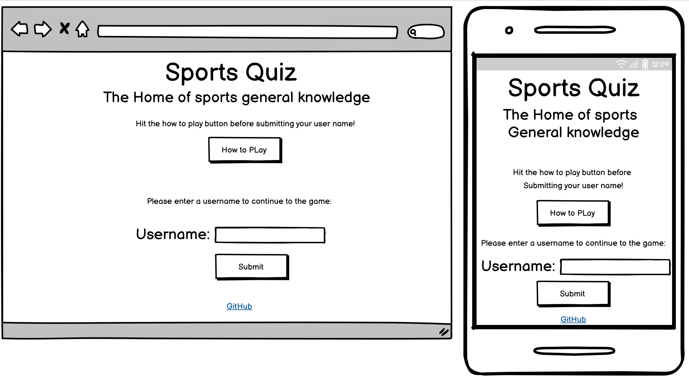
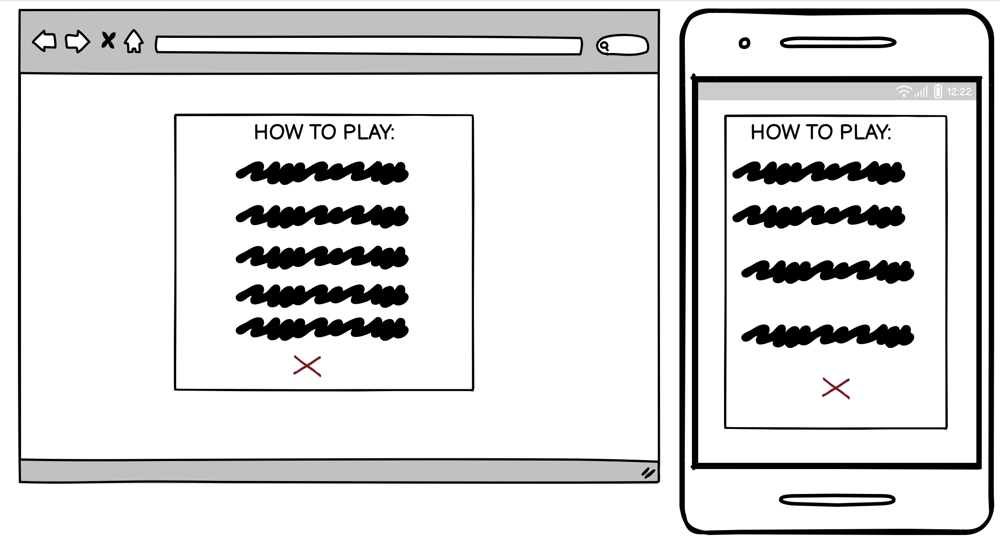
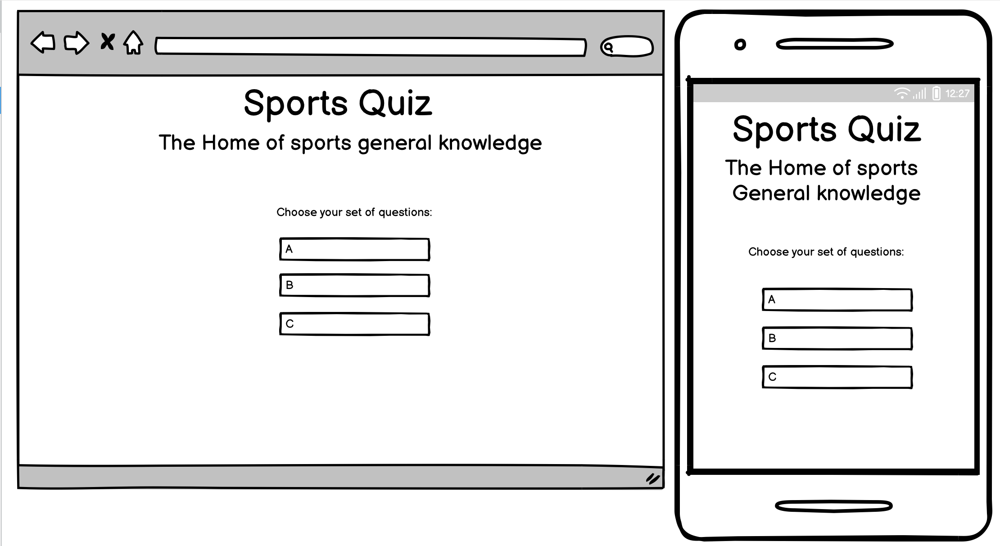
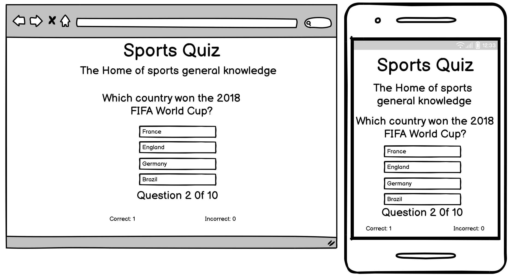
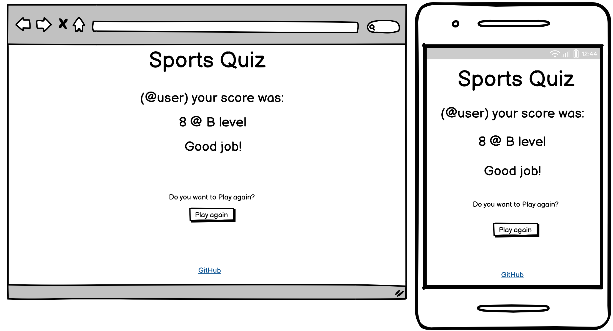

# Sports Quiz
(Developed by: Marc Hopkins)

[Live webpage](https://marchopkins96.github.io/sports-quiz/)

## Introduction 

Sports Quiz is a multiple choice online quiz testing the sports knowledge of the users who play it. There are three levels to choose from. The user will see how many questions are left as they progress and how many they answer correctly and incorrectly.

## Project Goals

### User Goals
- The site user wants to play an online sports quiz which will test their knowledge about an array of sports.

### Site Developer Goals
- The developer's goal is to provide a fun, engaging and adequately challenging sports quiz for its users.
  
## User Experience 

### Strategy 

#### Target Audience
- Users who have a keen interest in sports.
- Users who are looking to put their sports knowledge to the test.
  
#### User Expectations
- Site easy to naviagte around.
- Feedback as a user progresses through the quiz.
- Visually appealing design.

#### User Stories

##### First-Time User 
As a first time user, I want to ...
1. easily navigate through the quiz.
2. get feedback on scores as i progress.
3. easily return to the beginning and play again.
   
##### Returning Users
As a returning user, I want to ...
1. Try different levels.
2. Beat my previous scores.
3. potentially check out the developer who made the quiz.

### Structure & Design 

#### Wireframes

1. **Home Section** displays a short introduction to the quiz and the users are encouraged to click the 'How to Play' button. Further down the page there is an option to enter and submit a username.

2. **How To Play** Once the how to play button has been clicked it will appear as a pop up card on the screen. It will feature all the instructions for the quiz game. Once a user is finished with the page an exit button will take them back to the home page.

3. **Question Level Choice** The user has three sets of multiple choice questions to choose from.

4. **Quiz Question Area** The user has 10 questions to answer once in this part of the site. The scores will be tracked at the bottom of the quiz card.

5. **End of Quiz Section** Displays a users final score at what level they chose to play at. A short message will appear for the user which will differ depending on how they scored. There will also be a play again option.

6. **404 Error Page** A simple 404 page is also included (404.html).

